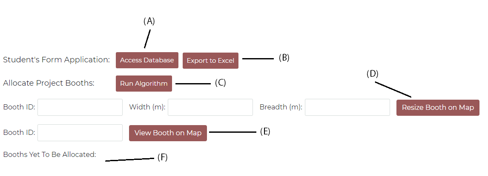
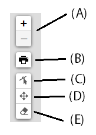

# Elements of Software Construction: Capstone Allocation

## Cohort 3 Group 7

Jazreel Kwek

Jeremy Chew

Suhas Sahu

Yeh Swee Khim

-----

## Installation

You will need to be running a local MySQL server.

**To install the necessary modules**, run

`npm install`

**To start the front-end server**, run

`npm start` 

in the root directory.

**To start the back-end server**, run

`node src/map/index2.js`

in the root directory.

## Testing

**To run the unit tests**, run

`npm test`

## Usage

The program can be found at http://localhost:3000/.

Most of the student pages are fairly self-explanatory.

**For Admins**

The admin page contains several features that will help with the allocation of Capstone booths.

(A): Redirects to a page containing a JSON dump of the booths loaded in the database.

(B): Exports the booths (and their associated information) as an Excel file

(C): Runs the allocation algorithm. The booths must have already been loaded into the database.

(D): Precisely edit the dimensions of a booth in the database. It will update the dimensions accordingly on the map.

(E): Highlights the location of the booth on the map.

(F): If booths have not be assigned a spot on the map, either by hand or through the algorithm, their IDs will be listed here.

Admins can also use the toolbar located at the top-left hand corner of the map to edit the booths directly on the map.

(A): Controls the zoom of the map

(B): Prints the map as a PDF document

(C): Enables edits to booths' dimensions

(D): Enables edits to booths' positions

(E): Removes a booth from the map.